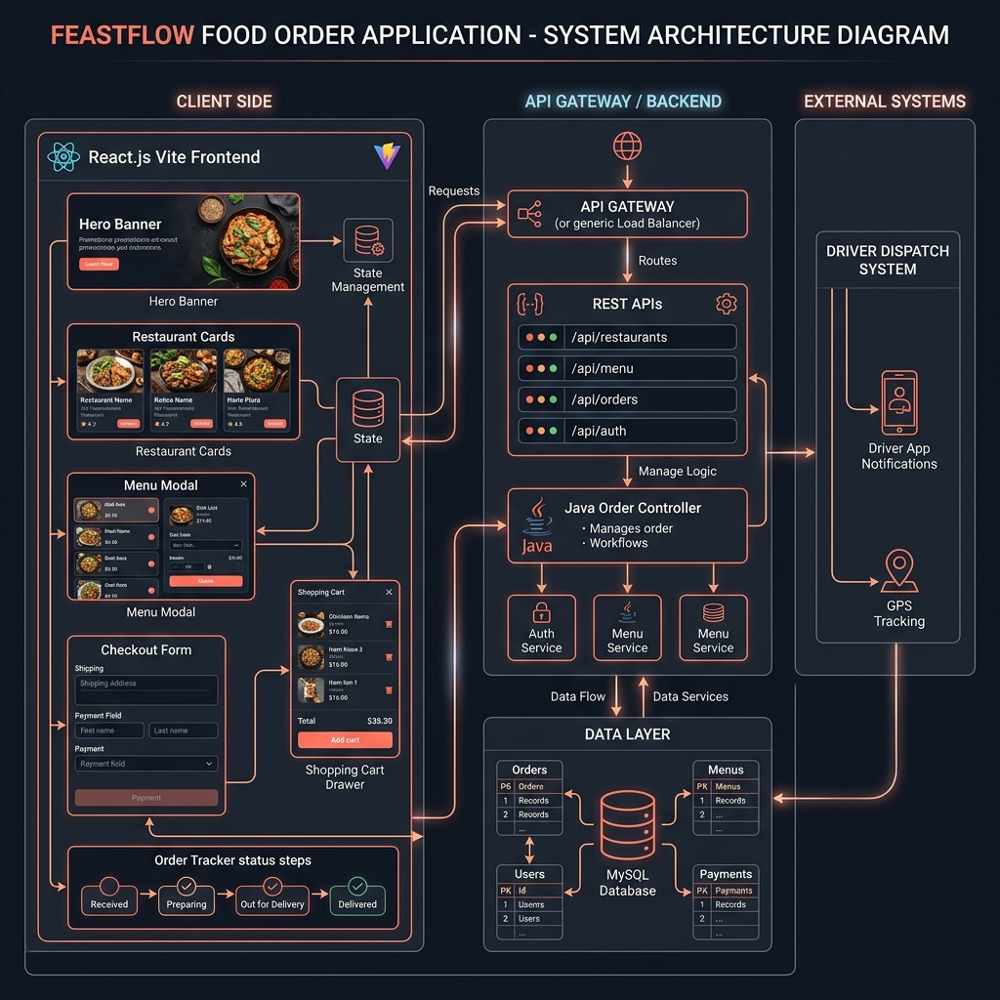
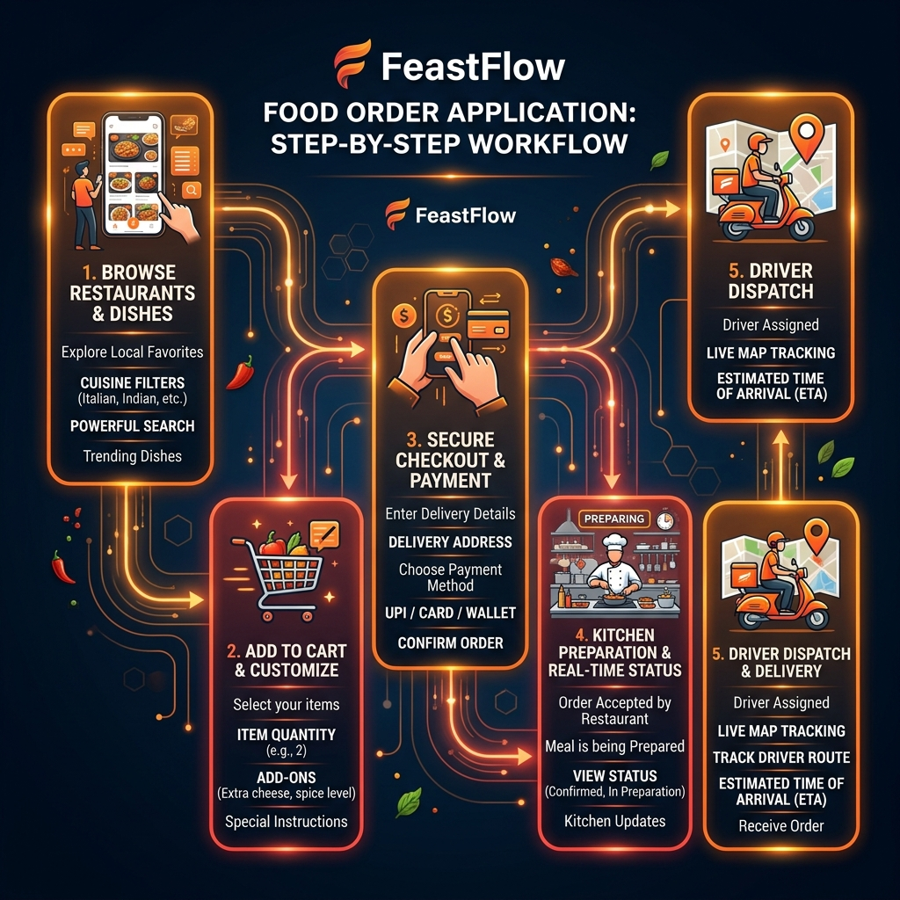
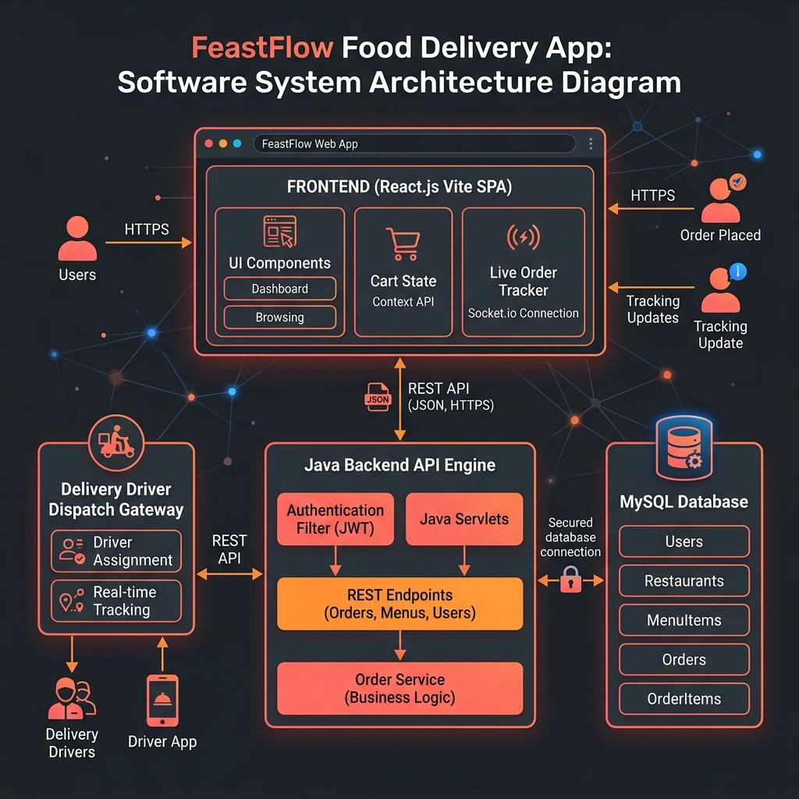
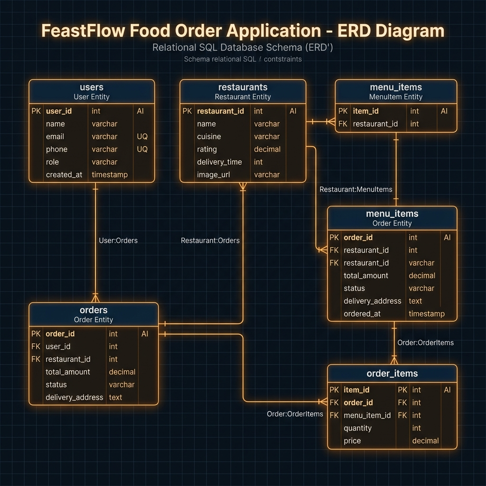
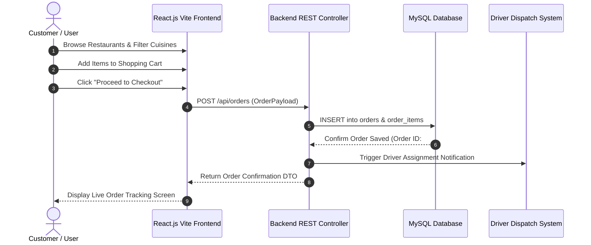

# 🍔 FeastFlow Food Delivery Application - Complete Master Flow Diagrams & Architecture Document

This master document consolidates all **end-to-end flow diagrams, visual system architecture with populated backend/frontend fields, database ERDs, order processing pipelines, sequence charts, and Vercel deployment configurations** for the **FeastFlow Food Delivery Application** into a single master document.

---

## 🎨 Master Visual Diagram Directory

| Diagram Title | Description | Image Asset Link |
| :--- | :--- | :--- |
| **Detailed Software System Architecture** | Populated Frontend UI fields, Spring Boot/Servlet API controllers, Cart Drawer, Checkout Form, Database Schemas, Driver Dispatch | [`food_full_system_detailed.png`](docs/images/food_full_system_detailed.png) |
| **End-to-End Order Workflow Process** | 5-Step process from browsing restaurants to cart customization, secure checkout, kitchen prep, and live driver tracking | [`food_order_workflow.png`](docs/images/food_order_workflow.png) |
| **Software System Architecture** | React.js Vite SPA Frontend, Java Backend Engine, MySQL Database, and Driver Dispatch System | [`food_system_architecture.png`](docs/images/food_system_architecture.png) |
| **Database ERD Schema** | Relational SQL tables (`users`, `restaurants`, `menu_items`, `orders`, `order_items`) | [`food_database_schema.png`](docs/images/food_database_schema.png) |

---

## 1. Detailed Software System Architecture (Populated Backend & Frontend)

This diagram details all populated parameters, endpoints, and data fields across the application stack:

### Client-Side (React.js Vite SPA)
- **Hero Banner**: Promotional banners & location selector.
- **Restaurant Cards**: Dynamic listing of artisanal kitchens, rating badges, delivery speed, and cuisine filters.
- **Menu Modal**: Detailed item cards with price, description, customization add-ons, and quantity selector.
- **Shopping Cart Drawer**: Real-time itemized order summary, subtotals, delivery fees, and promo code inputs.
- **Checkout Form**: Address fields, contact phone, payment method selector (UPI, Card, Cash on Delivery).
- **Order Tracker Status**: Live multi-step status indicator (`Received` $\rightarrow$ `Preparing` $\rightarrow$ `Out for Delivery` $\rightarrow$ `Delivered`).

### API Gateway & Backend Services
- `/api/restaurants` - Returns active restaurant listings & filter categories.
- `/api/menu` - Fetches menu items by restaurant ID.
- `/api/orders` - Creates order records, calculates bill totals, and triggers kitchen prep status.
- `/api/auth` - Authenticates customer login & user profiles.

---

## 2. End-to-End Food Order & Delivery Workflow Process

This infographic details the 5 sequential phases of customer order processing:

1. **Browse Restaurants & Dishes**: Search top-rated kitchens and filter by cuisine (Italian, Indian, Chinese, Healthy).
2. **Add to Cart & Customize**: Choose dishes, quantity, spice levels, and special instructions.
3. **Secure Checkout & Payment**: Select delivery address and choose payment method (UPI / Credit Card / Cash).
4. **Kitchen Preparation & Status**: Restaurant receives order and updates status to "Meal Being Prepared".
5. **Driver Dispatch & Delivery**: Delivery driver is assigned with real-time GPS map tracking and ETA updates.

---

## 3. High-Level Software System Architecture

---

## 4. Database Schema & Entity Relationship Diagram (ERD)

This entity-relationship diagram shows the relational schema across all core database tables:
- `USERS`: Customer accounts, delivery addresses, phone numbers, and roles.
- `RESTAURANTS`: Store profiles, cuisine categories, ratings, and image URLs.
- `MENU_ITEMS`: Individual menu items linked to parent restaurants.
- `ORDERS`: Order headers containing user IDs, total amounts, delivery status, and timestamps.
- `ORDER_ITEMS`: Junction table storing ordered items, quantities, and line item prices.

---

## 5. End-to-End Sequence Diagram

---

## 🚀 Deployment Information

- **Vercel Live URL**: [**`https://feastflow-food-delivery-app-k34c.vercel.app`**](https://feastflow-food-delivery-app-k34c.vercel.app)
- **GitHub Repository**: [https://github.com/Ramesh2200/feastflow-food-delivery-app](https://github.com/Ramesh2200/feastflow-food-delivery-app)
