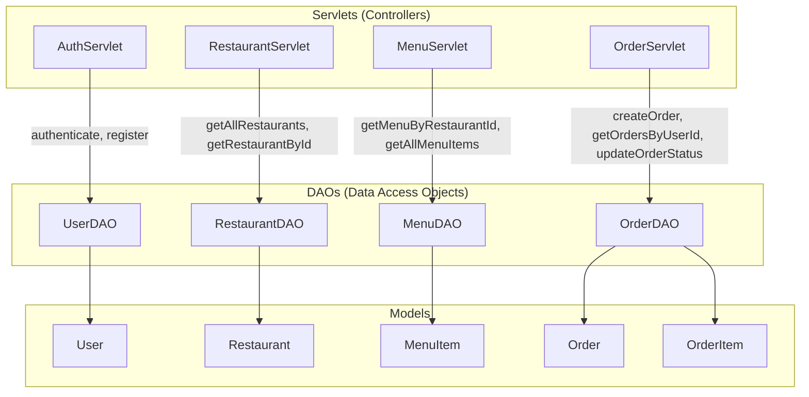

# Controller & DAO Service Mapping Documentation

Documentation detailing how each Servlet Controller interacts with Data Access Objects (DAOs) and Database Models.

---

## 1. Controller ⬌ DAO Interaction Matrix

---

## 2. Detailed Servlet Specifications

### 2.1 `AuthServlet`
- **URL Mapping**: `/api/auth/*`
- **Source File**: [`AuthServlet.java`](file:///Users/chinnesh/.gemini/antigravity-ide/scratch/food-delivery-app/backend/src/main/java/com/foodapp/servlet/AuthServlet.java)
- **DAO Injected**: `UserDAO`

| Endpoint Path | HTTP Method | Action / Helper | DAO Method Called | Request Payload | Response Data |
| :--- | :--- | :--- | :--- | :--- | :--- |
| `/api/auth/send-otp` | `POST` | Generates 4-digit OTP code | In-memory `otpStore` | `{ "email": "..." }` | `{ "success": true, "otp": "8250" }` |
| `/api/auth/verify-otp` | `POST` | Validates OTP code | In-memory `otpStore` | `{ "email": "...", "otp": "8250" }` | `{ "success": true }` |
| `/api/auth/login` | `POST` | Authenticates credentials | `UserDAO.authenticate(email, password)` | `{ "email": "...", "password": "..." }` | `{ "success": true, "user": User }` |
| `/api/auth/register` | `POST` | Creates user account | `UserDAO.register(User)` | `{ "fullName": "...", "email": "...", "password": "...", "phone": "..." }` | `{ "success": true, "user": User }` |

---

### 2.2 `RestaurantServlet`
- **URL Mapping**: `/api/restaurants/*`
- **Source File**: [`RestaurantServlet.java`](file:///Users/chinnesh/.gemini/antigravity-ide/scratch/food-delivery-app/backend/src/main/java/com/foodapp/servlet/RestaurantServlet.java)
- **DAO Injected**: `RestaurantDAO`

| Endpoint Path | HTTP Method | Action | DAO Method Called | Request Parameters | Response Data |
| :--- | :--- | :--- | :--- | :--- | :--- |
| `/api/restaurants` | `GET` | Fetch all 15 restaurants | `RestaurantDAO.getAllRestaurants()` | None | `List<Restaurant>` |
| `/api/restaurants/{id}` | `GET` | Fetch single restaurant details | `RestaurantDAO.getRestaurantById(id)` | Path variable `{id}` | `Restaurant` object |

---

### 2.3 `MenuServlet`
- **URL Mapping**: `/api/menu/*`
- **Source File**: [`MenuServlet.java`](file:///Users/chinnesh/.gemini/antigravity-ide/scratch/food-delivery-app/backend/src/main/java/com/foodapp/servlet/MenuServlet.java)
- **DAO Injected**: `MenuDAO`

| Endpoint Path | HTTP Method | Action | DAO Method Called | Request Parameters | Response Data |
| :--- | :--- | :--- | :--- | :--- | :--- |
| `/api/menu?restaurant_id={id}` | `GET` | Fetch 20 dishes for restaurant | `MenuDAO.getMenuByRestaurantId(restaurantId)` | `restaurant_id` query param | `List<MenuItem>` |
| `/api/menu` | `GET` | Fetch all menu items | `MenuDAO.getAllMenuItems()` | None | `List<MenuItem>` |

---

### 2.4 `OrderServlet`
- **URL Mapping**: `/api/orders/*`
- **Source File**: [`OrderServlet.java`](file:///Users/chinnesh/.gemini/antigravity-ide/scratch/food-delivery-app/backend/src/main/java/com/foodapp/servlet/OrderServlet.java)
- **DAO Injected**: `OrderDAO`

| Endpoint Path | HTTP Method | Action | DAO Method Called | Request Payload / Params | Response Data |
| :--- | :--- | :--- | :--- | :--- | :--- |
| `/api/orders?user_id={id}` | `GET` | Fetch orders for customer | `OrderDAO.getOrdersByUserId(userId)` | `user_id` query param | `user_id` query param | `List<Order>` |
| `/api/orders` | `GET` | Fetch all system orders | `OrderDAO.getAllOrders()` | None (Manager/Admin) | `List<Order>` |
| `/api/orders` | `POST` | Place new order transaction | `OrderDAO.createOrder(Order)` | `{ "userId": 2, "restaurantId": 1, "items": [...], "paymentMethod": "COD" }` | `201 Created` `{ Order }` |
| `/api/orders` | `PUT` | Update status (`PLACED` ➔ `CONFIRMED` ➔ `DELIVERED`) | `OrderDAO.updateOrderStatus(orderId, status)` | `{ "order_id": 1, "status": "OUT_FOR_DELIVERY" }` | `{ "success": true }` |
