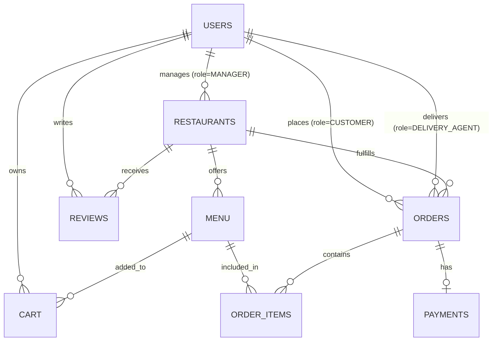

# Database Design & Entity Relationship Documentation

Complete documentation for the relational database schema **`food_delivery_db`**, table definitions, relationships, and Java Model mapping.

---

## 1. Entity Relationship Diagram (ERD)

---

## 2. Relational Schema & Java Class Mappings

### 2.1 Table: `users`
- **Description**: Stores user accounts for all roles (Customers, Managers, Delivery Agents, System Admins).
- **Primary Key**: `user_id`
- **Mapped Java Class**: [`User.java`](file:///Users/chinnesh/.gemini/antigravity-ide/scratch/food-delivery-app/backend/src/main/java/com/foodapp/model/User.java)

| Column Name | Data Type | Constraints | Description |
| :--- | :--- | :--- | :--- |
| `user_id` | `INT` | `AUTO_INCREMENT`, `PRIMARY KEY` | Unique user identification |
| `full_name` | `VARCHAR(100)` | `NOT NULL` | Full name of user |
| `email` | `VARCHAR(100)` | `UNIQUE`, `NOT NULL` | Account login email |
| `password` | `VARCHAR(255)` | `NOT NULL` | Hashed/plaintext password |
| `phone` | `VARCHAR(15)` | `NULLABLE` | Contact phone number |
| `role` | `ENUM` | `'ADMIN','CUSTOMER','MANAGER','DELIVERY_AGENT'` | User authorization role |
| `address` | `TEXT` | `NULLABLE` | Default delivery address |
| `city` | `VARCHAR(50)` | `NULLABLE` | City location |
| `state` | `VARCHAR(50)` | `NULLABLE` | State location |
| `pincode` | `VARCHAR(10)` | `NULLABLE` | Postal area code |
| `created_at` | `TIMESTAMP` | `DEFAULT CURRENT_TIMESTAMP` | Account registration time |

---

### 2.2 Table: `restaurants`
- **Description**: Stores restaurant profiles managed by users with role `MANAGER`.
- **Primary Key**: `restaurant_id`
- **Foreign Keys**: `manager_id` ➔ `users(user_id)`
- **Mapped Java Class**: [`Restaurant.java`](file:///Users/chinnesh/.gemini/antigravity-ide/scratch/food-delivery-app/backend/src/main/java/com/foodapp/model/Restaurant.java)

| Column Name | Data Type | Constraints | Description |
| :--- | :--- | :--- | :--- |
| `restaurant_id` | `INT` | `AUTO_INCREMENT`, `PRIMARY KEY` | Unique restaurant ID |
| `manager_id` | `INT` | `FOREIGN KEY` ➔ `users(user_id)` | Manager account ID |
| `restaurant_name` | `VARCHAR(100)` | `NOT NULL` | Brand name of restaurant |
| `cuisine` | `VARCHAR(50)` | `NOT NULL` | Cuisine category (Italian, Indian, etc.) |
| `phone` | `VARCHAR(15)` | `NULLABLE` | Contact phone number |
| `address` | `TEXT` | `NOT NULL` | Physical restaurant address |
| `rating` | `DECIMAL(2,1)` | `DEFAULT 4.5` | Average customer rating |
| `image` | `VARCHAR(255)` | `NULLABLE` | Image banner URL |
| `status` | `ENUM` | `'OPEN','CLOSED'`, `DEFAULT 'OPEN'` | Operational status |

---

### 2.3 Table: `menu`
- **Description**: Dishes offered by each restaurant.
- **Primary Key**: `menu_id`
- **Foreign Keys**: `restaurant_id` ➔ `restaurants(restaurant_id)`
- **Mapped Java Class**: [`MenuItem.java`](file:///Users/chinnesh/.gemini/antigravity-ide/scratch/food-delivery-app/backend/src/main/java/com/foodapp/model/MenuItem.java)

| Column Name | Data Type | Constraints | Description |
| :--- | :--- | :--- | :--- |
| `menu_id` | `INT` | `AUTO_INCREMENT`, `PRIMARY KEY` | Unique dish ID |
| `restaurant_id` | `INT` | `FOREIGN KEY` ➔ `restaurants` | Owning restaurant |
| `item_name` | `VARCHAR(100)` | `NOT NULL` | Name of dish |
| `description` | `TEXT` | `NULLABLE` | Dish description & ingredients |
| `price` | `DECIMAL(10,2)` | `NOT NULL` | Item price in ₹ |
| `category` | `VARCHAR(50)` | `NOT NULL` | Menu section (Pizza, Pasta, Dessert) |
| `image` | `VARCHAR(255)` | `NULLABLE` | High-res food photo URL |
| `available` | `BOOLEAN` | `DEFAULT TRUE` | In-stock flag |

---

### 2.4 Table: `orders`
- **Description**: Master table for customer food orders.
- **Primary Key**: `order_id`
- **Foreign Keys**: `user_id` ➔ `users(user_id)`, `restaurant_id` ➔ `restaurants(restaurant_id)`, `delivery_agent_id` ➔ `users(user_id)`
- **Mapped Java Class**: [`Order.java`](file:///Users/chinnesh/.gemini/antigravity-ide/scratch/food-delivery-app/backend/src/main/java/com/foodapp/model/Order.java)

| Column Name | Data Type | Constraints | Description |
| :--- | :--- | :--- | :--- |
| `order_id` | `INT` | `AUTO_INCREMENT`, `PRIMARY KEY` | Unique order ID |
| `user_id` | `INT` | `FOREIGN KEY` ➔ `users` | Ordering customer ID |
| `restaurant_id` | `INT` | `FOREIGN KEY` ➔ `restaurants` | Restaurant ID |
| `delivery_agent_id` | `INT` | `FOREIGN KEY` ➔ `users` | Assigned delivery agent |
| `total_amount` | `DECIMAL(10,2)` | `NOT NULL` | Grand total in ₹ |
| `payment_method` | `ENUM` | `'COD','UPI','CARD'` | Selected payment option |
| `order_status` | `ENUM` | `'PLACED','CONFIRMED','PREPARING','OUT_FOR_DELIVERY','DELIVERED','CANCELLED'` | Live order status |
| `delivery_address` | `TEXT` | `NOT NULL` | Destination address |
| `order_date` | `TIMESTAMP` | `DEFAULT CURRENT_TIMESTAMP` | Timestamp placed |

---

### 2.5 Table: `order_items`
- **Description**: Line items belonging to an order.
- **Primary Key**: `order_item_id`
- **Foreign Keys**: `order_id` ➔ `orders(order_id)`, `menu_id` ➔ `menu(menu_id)`
- **Mapped Java Class**: [`OrderItem.java`](file:///Users/chinnesh/.gemini/antigravity-ide/scratch/food-delivery-app/backend/src/main/java/com/foodapp/model/OrderItem.java)

| Column Name | Data Type | Constraints | Description |
| :--- | :--- | :--- | :--- |
| `order_item_id` | `INT` | `AUTO_INCREMENT`, `PRIMARY KEY` | Unique line item ID |
| `order_id` | `INT` | `FOREIGN KEY` ➔ `orders` | Parent order ID |
| `menu_id` | `INT` | `FOREIGN KEY` ➔ `menu` | Ordered dish ID |
| `quantity` | `INT` | `NOT NULL` | Number of items |
| `price` | `DECIMAL(10,2)` | `NOT NULL` | Unit item price |

---

### 2.6 Table: `cart`
- **Description**: Temporary user cart storage.
- **Primary Key**: `cart_id`
- **Foreign Keys**: `user_id` ➔ `users(user_id)`, `menu_id` ➔ `menu(menu_id)`

| Column Name | Data Type | Constraints | Description |
| :--- | :--- | :--- | :--- |
| `cart_id` | `INT` | `AUTO_INCREMENT`, `PRIMARY KEY` | Cart item ID |
| `user_id` | `INT` | `FOREIGN KEY` ➔ `users` | Cart owner ID |
| `menu_id` | `INT` | `FOREIGN KEY` ➔ `menu` | Selected dish |
| `quantity` | `INT` | `DEFAULT 1` | Quantity |

---

### 2.7 Table: `payments` & `reviews`
- `payments`: `payment_id`, `order_id` (FK), `payment_method`, `payment_status`, `transaction_id`, `payment_date`.
- `reviews`: `review_id`, `user_id` (FK), `restaurant_id` (FK), `rating`, `comments`, `review_date`.
