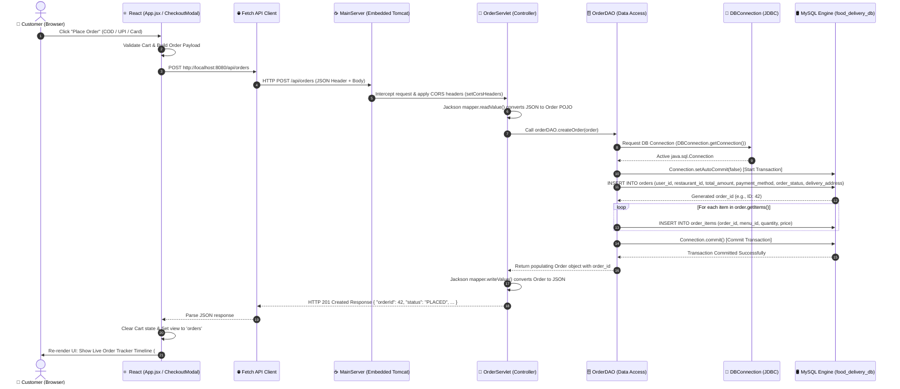
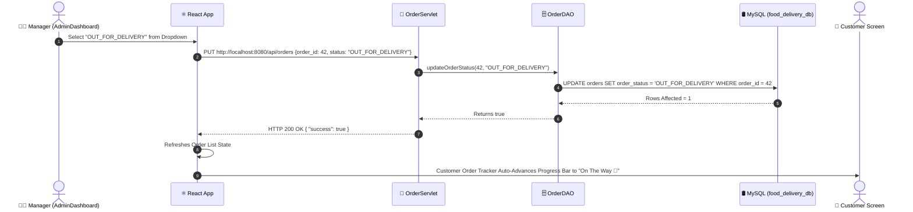

# End-to-End Architectural Flow Diagram & Step-by-Step Execution Guide

This document presents the complete **End-to-End Step-by-Step Architectural Flow** of the **FeastFlow** application, tracing request lifecycles from user interactions in the React UI down through the Java Servlets REST API, DAO layer, JDBC database connection, and MySQL storage engine.

---

## 1. Master End-to-End System Flow Architecture

```mermaid
flowchart TD
    subgraph Step1["Step 1: User Action (React Frontend)"]
        U1[User Clicks Action e.g. Login / Add to Cart / Place Order] --> U2[React Component State Trigger]
        U2 --> U3[Construct REST Payload / JSON Body]
    end

    subgraph Step2["Step 2: Client-Side HTTP Dispatch"]
        U3 --> H1[Fetch API Call to http://localhost:8080/api/*]
        H1 --> H2[Browser Transmits HTTP Method GET / POST / PUT]
    end

    subgraph Step3["Step 3: Embedded Tomcat & Servlet Routing"]
        H2 --> T1[Embedded Tomcat Port 8080 Listener]
        T1 --> T2[BaseServlet CORS & Content-Type Headers Injection]
        T2 --> T3{Request Path Inspection}
        
        T3 -->|/api/auth/*| S1[AuthServlet]
        T3 -->|/api/restaurants/*| S2[RestaurantServlet]
        T3 -->|/api/menu/*| S3[MenuServlet]
        T3 -->|/api/orders/*| S4[OrderServlet]
    end

    subgraph Step4["Step 4: Servlet Processing & JSON Deserialization"]
        S1 & S2 & S3 & S4 --> P1[Jackson ObjectMapper Deserializes JSON to POJO Model]
        P1 --> P2[Business Validation & Helper Logic]
    end

    subgraph Step5["Step 5: Data Access Object (DAO) Execution"]
        P2 --> D1{Select Corresponding DAO}
        D1 -->|User Operations| DAO1[UserDAO]
        D1 -->|Restaurant Operations| DAO2[RestaurantDAO]
        D1 -->|Menu Operations| DAO3[MenuDAO]
        D1 -->|Order Operations| DAO4[OrderDAO]
    end

    subgraph Step6["Step 6: Database Connection & JDBC Transaction"]
        DAO1 & DAO2 & DAO3 & DAO4 --> J1[DBConnection.getConnection]
        J1 --> J2[DriverManager acquires Connection: root@localhost:3306/food_delivery_db]
        J2 --> J3[Prepare PreparedStatement with SQL & Bind Parameters]
    end

    subgraph Step7["Step 7: MySQL Storage Engine Execution"]
        J3 --> M1[Execute Query / Update / Insert Transaction]
        M1 --> M2[(MySQL Engine: food_delivery_db Tables)]
        M2 --> M3[Return ResultSet or Generated Primary Key]
    end

    subgraph Step8["Step 8: Result Mapping & Response Construction"]
        M3 --> R1[DAO Iterates ResultSet & Instantiates Java Models]
        R1 --> R2[Servlet Receives Model / Collection]
        R2 --> R3[Jackson ObjectMapper Serializes Model to JSON String]
        R3 --> R4[Servlet Writes JSON Response Stream HTTP 200/201]
    end

    subgraph Step9["Step 9: React UI Re-Rendering"]
        R4 --> C1[Browser Receives Response JSON]
        C1 --> C2[React State Hook Update setOrders / setRestaurants / setCurrentUser]
        C2 --> C3[Virtual DOM Diffing & UI Re-Render]
    end
```

---

## 2. Detailed Step-by-Step Lifecycle Tracing

### 📍 Flow A: Complete Order Placement Lifecycle (Step-by-Step)

---

### 📍 Flow B: Manager Order Status Update Lifecycle (Step-by-Step)

---

## 3. Step-by-Step Architectural Layer Breakdown

| Step # | Layer Name | Technology Used | Responsibilities | Key Source File |
| :--- | :--- | :--- | :--- | :--- |
| **Step 1** | **User Interface (UI)** | React 18, JSX, Lucide Icons | Handles user clicks, form submissions, and component renders | [`App.jsx`](file:///Users/chinnesh/.gemini/antigravity-ide/scratch/food-delivery-app/frontend/src/App.jsx) |
| **Step 2** | **HTTP Client** | Browser Fetch API | Asynchronously transmits JSON payloads over HTTP REST | [`AuthModal.jsx`](file:///Users/chinnesh/.gemini/antigravity-ide/scratch/food-delivery-app/frontend/src/components/AuthModal.jsx) |
| **Step 3** | **Web Container** | Embedded Apache Tomcat 10 | Listens on port 8080, routes incoming requests to mapped Servlets | [`MainServer.java`](file:///Users/chinnesh/.gemini/antigravity-ide/scratch/food-delivery-app/backend/src/main/java/com/foodapp/MainServer.java) |
| **Step 4** | **CORS & Base Servlet** | Jakarta Servlet API | Appends CORS header flags (`Access-Control-Allow-Origin: *`) | [`BaseServlet.java`](file:///Users/chinnesh/.gemini/antigravity-ide/scratch/food-delivery-app/backend/src/main/java/com/foodapp/servlet/BaseServlet.java) |
| **Step 5** | **Servlet Controllers** | Jakarta `@WebServlet` | Deserializes JSON request streams to Java Model POJOs | [`OrderServlet.java`](file:///Users/chinnesh/.gemini/antigravity-ide/scratch/food-delivery-app/backend/src/main/java/com/foodapp/servlet/OrderServlet.java) |
| **Step 6** | **DAO Access Layer** | Java Data Access Objects | Contains SQL business logic, query construction, and transactions | [`OrderDAO.java`](file:///Users/chinnesh/.gemini/antigravity-ide/scratch/food-delivery-app/backend/src/main/java/com/foodapp/dao/OrderDAO.java) |
| **Step 7** | **JDBC Connector** | MySQL Connector/J (`com.mysql.cj.jdbc.Driver`) | Manages connection strings (`jdbc:mysql://localhost:3306/food_delivery_db`) | [`DBConnection.java`](file:///Users/chinnesh/.gemini/antigravity-ide/scratch/food-delivery-app/backend/src/main/java/com/foodapp/config/DBConnection.java) |
| **Step 8** | **Database Storage** | MySQL 8.0 Engine | Executes SQL DDL/DML, enforces FK constraints and ACID properties | `food_delivery_db` |
