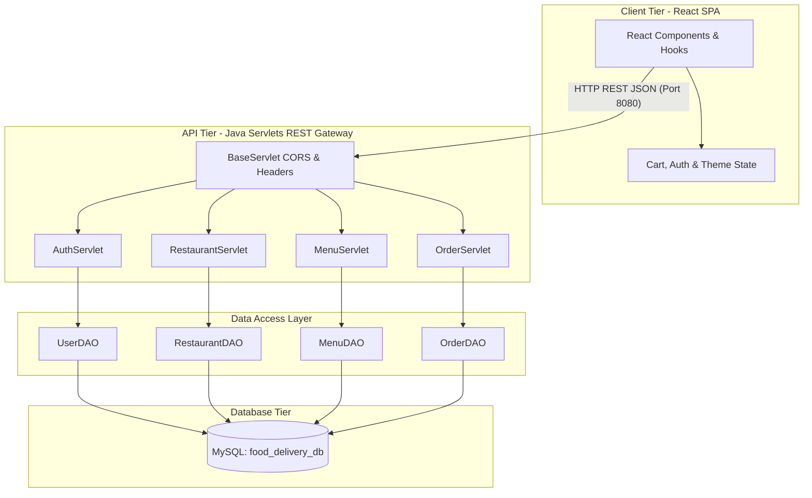
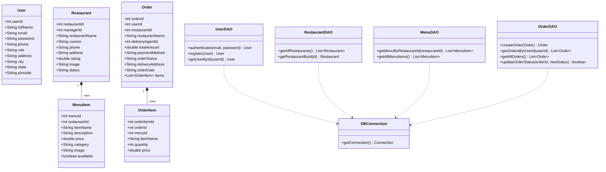
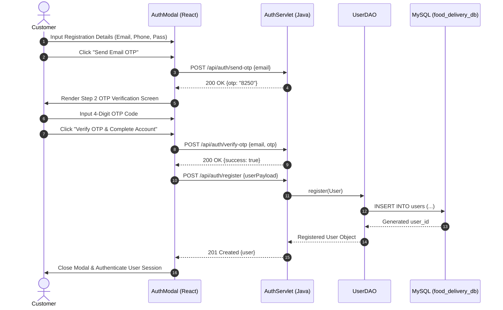
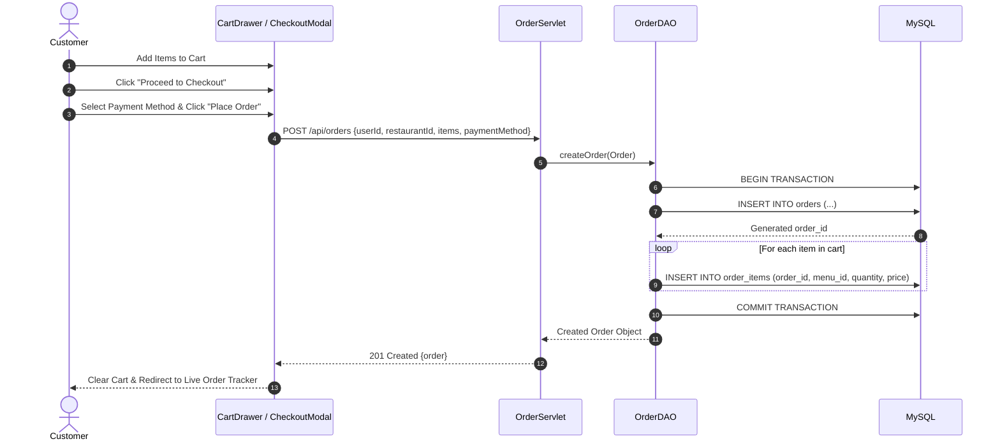
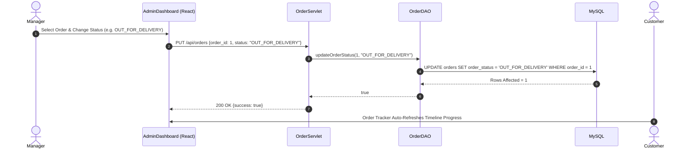

# System Architecture & Diagrams

Comprehensive architectural design documentation for the **FeastFlow** Food Order & Delivery Application.

---

## 1. High-Level Architecture Overview

FeastFlow implements a decoupled **Client-Server Single Page Application (SPA)** pattern.



---

## 2. MVC Design Pattern Architecture

```mermaid
graph LR
    subgraph Model Layer (Java POJOs)
        M1[User]
        M2[Restaurant]
        M3[MenuItem]
        M4[Order]
        M5[OrderItem]
    end

    subgraph View Layer (React SPA + HTML/CSS)
        V1[Explore Page]
        V2[Restaurant Detail]
        V3[Cart Drawer]
        V4[Order Tracker]
        V5[Admin Dashboard]
    end

    subgraph Controller Layer (Java Servlets)
        C1[AuthServlet]
        C2[RestaurantServlet]
        C3[MenuServlet]
        C4[OrderServlet]
    end

    V1 -- REST Requests --> C2
    V2 -- REST Requests --> C3
    V3 -- REST Requests --> C4
    V4 -- REST Requests --> C4
    
    C1 -- JSON Mapping --> M1
    C2 -- JSON Mapping --> M2
    C3 -- JSON Mapping --> M3
    C4 -- JSON Mapping --> M4
```

---

## 3. Detailed Class Diagram



---

## 4. End-to-End Sequence Diagrams

### 4.1 User Authentication & Email OTP Flow



### 4.2 Checkout & Order Placement Flow



### 4.3 Order Status Update Flow (Manager / Admin)


